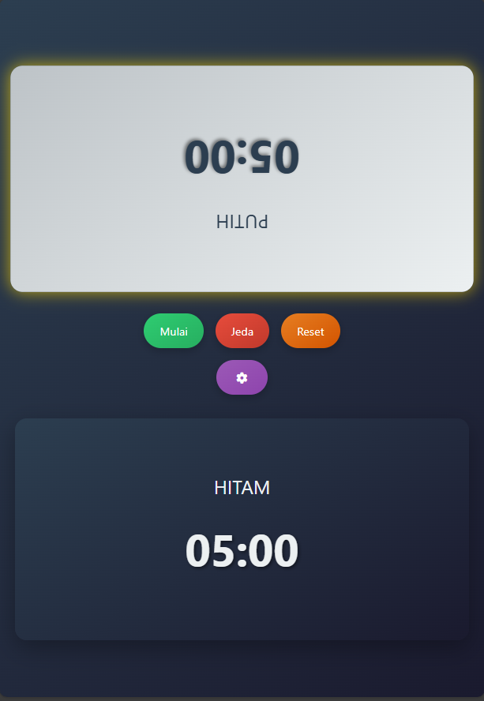

# ♟️ Timer Catur

Timer Catur adalah aplikasi web interaktif untuk permainan catur dengan fitur timer ganda yang fleksibel dan antarmuka responsif.  
Aplikasi ini bisa dijalankan di desktop maupun perangkat mobile.

---

## 📋 Deskripsi
Timer Catur dirancang untuk memberikan pengalaman bermain catur lebih terstruktur dengan pengatur waktu yang dapat disesuaikan.  
Memiliki tampilan intuitif, efek visual interaktif, dan kontrol mudah digunakan.

---

## ✨ Fitur Utama
- **⏱️ Timer Ganda**: Timer terpisah untuk pemain putih dan hitam.  
- **🎮 Kontrol Mudah**: Tombol mulai, jeda, reset, dan pengaturan.  
- **⚙️ Pengaturan Fleksibel**: Atur waktu dalam menit dan detik.  
- **📱 Antarmuka Responsif**:  
  - Desktop (landscape) → Timer kiri & kanan.  
  - Mobile (portrait) → Timer atas & bawah.  
- **⚡ Popup Pengaturan Dinamis**: Panel pengaturan muncul di tengah layar.  
- **💡 Efek Visual**:  
  - Highlight pemain aktif.  
  - Peringatan saat waktu hampir habis.  
  - Animasi halus.

---

## 🎮 Cara Menggunakan
1. **Atur Waktu**  
   - Klik tombol **Setting** di tengah halaman.  
   - Masukkan menit dan detik.  
   - Klik **Terapkan** untuk menyimpan.  

2. **Mulai Permainan**  
   - Klik tombol **Mulai** → Timer putih jalan pertama.  

3. **Ganti Pemain**  
   - Klik pada timer pemain setelah selesai giliran.  
   - Timer otomatis berganti ke lawan.  

4. **Kontrol Timer**  
   - **Jeda** → Hentikan sementara.  
   - **Reset** → Kembali ke pengaturan awal.  

5. **Akhir Permainan**  
   - Timer otomatis berhenti jika waktu salah satu habis.  
   - Pemberitahuan muncul siapa pemenangnya.  

---

## 📱 Tampilan Responsif
- **Desktop/Layar Lebar** → Landscape, timer kiri & kanan.  
- **Mobile/Tablet** → Portrait, timer atas & bawah, kontrol di tengah.  

---

## 🛠️ Teknologi yang Digunakan
- HTML5  
- CSS3 (Flexbox, Gradient, Media Queries, Animation)  
- JavaScript (ES6)  
- [Font Awesome](https://fontawesome.com) → ikon  

---

## 🌐 Kompatibilitas
- Chrome (versi terbaru)  
- Firefox (versi terbaru)  
- Safari (versi terbaru)  
- Edge (versi terbaru)  
- Mobile (iOS & Android)  

---

## 📸 Preview


---

## 🚀 Cara Menjalankan
1. Clone repo:
   ```bash
   git clone https://github.com/username/timer-catur.git
